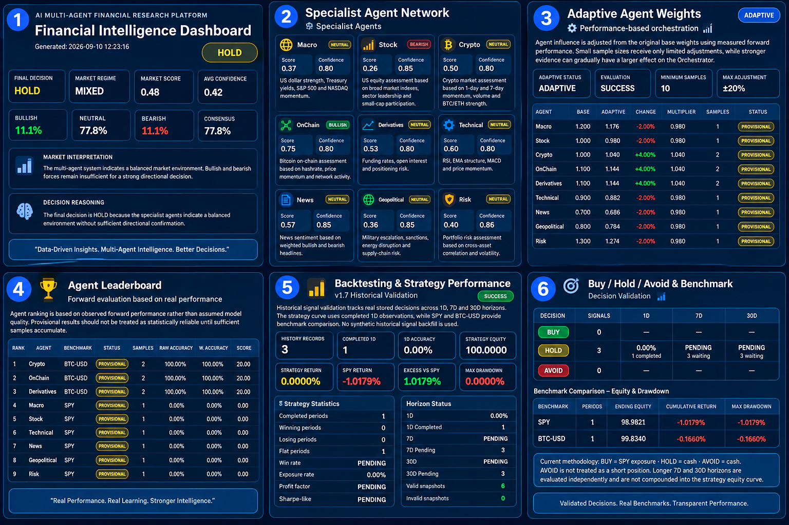

# AI Multi-Agent Financial Research Platform v1.7

## Financial Intelligence, Adaptive Agents & Historical Backtesting

AI Multi-Agent Financial Research Platform v1.7 is a Python-based financial research system designed to combine specialized AI-style analytical agents, central orchestration, adaptive intelligence, forward evaluation and historical strategy validation into one integrated research workflow.

The platform analyzes multiple dimensions of financial markets simultaneously and converts them into a structured market view, final decision and professional research dashboard.



---

## v1.7 Highlights

Version 1.7 introduces a dedicated **Backtesting & Strategy Performance Engine**, extending the platform from market analysis into measurable historical validation.

The system now tracks stored signals and evaluates how previous decisions performed across multiple forward horizons.

Key capabilities include:

- 9 specialized financial research agents
- Central multi-agent orchestrator
- Adaptive performance-based agent weighting
- Market memory and historical signal tracking
- Forward agent evaluation and leaderboard
- BUY / HOLD / AVOID decision framework
- 1-day, 7-day and 30-day validation horizons
- SPY and BTC-USD benchmark comparison
- Strategy equity tracking
- Cumulative return analysis
- Maximum drawdown measurement
- Win/loss statistics
- Exposure analysis
- Profit factor
- Sharpe-like risk-adjusted performance metric
- Automated TXT and JSON reporting
- Professional HTML Financial Intelligence Dashboard
- Research synthesis layer
- Automated daily research workflow

---

## Multi-Agent Architecture

The platform uses **9 specialized analytical agents**, each responsible for a different market dimension:

1. **Macro Agent** — US dollar, Treasury yields, S&P 500 and NASDAQ macro conditions.
2. **Stock Agent** — broad US equity indices, technology leadership, small-cap participation and relative strength.
3. **Crypto Agent** — Bitcoin, Ethereum and broader cryptocurrency momentum.
4. **OnChain Agent** — Bitcoin network activity, hashrate, transaction activity and on-chain conditions.
5. **Derivatives Agent** — funding rates, open interest and crypto derivatives positioning.
6. **Technical Agent** — RSI, EMA structure, MACD and price momentum.
7. **News Agent** — financial news sentiment and headline-based market signals.
8. **Geopolitical Agent** — geopolitical escalation, sanctions, conflict and energy-related risk.
9. **Risk Agent** — volatility, correlation, drawdown and cross-asset portfolio risk.

The specialist outputs are processed by a **Central Orchestrator**, which evaluates agreement, confidence, conflicts and risk conditions before producing the final market decision.

---

## Adaptive Agent Intelligence

Agent influence is not permanently fixed.

The platform measures observed forward performance and uses this information to gradually adjust agent weights.

The adaptive weighting system includes:

- Base agent weights
- Performance-based multipliers
- Sample-size controls
- Provisional weighting for limited observations
- Maximum adjustment limits
- Forward accuracy measurement

This creates a framework where the orchestration layer can progressively learn which analytical components have historically provided stronger signals.

---

## Forward Evaluation

The platform stores historical signals and evaluates them against future market behavior.

Evaluation horizons:

- **1 Day**
- **7 Days**
- **30 Days**

Benchmark mapping currently uses:

- **SPY** for equity, macro, technical, news, geopolitical and risk analysis
- **BTC-USD** for crypto, on-chain and derivatives analysis

An Agent Leaderboard ranks specialist agents according to observed forward performance rather than assumed model quality.

Results remain marked as **PROVISIONAL** until sufficient historical samples accumulate.

---

## v1.7 Backtesting Engine

The v1.7 Backtesting Engine provides historical validation of stored platform decisions.

It measures:

- Historical signal count
- Completed and pending observations
- Decision accuracy
- BUY / HOLD / AVOID performance
- Strategy equity
- Cumulative strategy return
- SPY benchmark return
- BTC-USD benchmark return
- Excess return versus SPY
- Maximum drawdown
- Winning and losing periods
- Win rate
- Exposure rate
- Profit factor
- Period volatility
- Annualized volatility
- Sharpe-like performance

The current strategy methodology is intentionally conservative:

**BUY = SPY exposure**

**HOLD = Cash**

**AVOID = Cash**

AVOID is not currently treated as a short position.

Longer 7-day and 30-day horizons are evaluated independently and are not compounded into the primary strategy equity curve.

No synthetic historical signal backfill is used. Performance statistics are built from real signals stored by the running system.

---

## Financial Intelligence Dashboard

The HTML dashboard combines the major intelligence layers into a single professional interface:

- Final market decision
- Market regime
- Market score
- Average confidence
- Bullish / Neutral / Bearish distribution
- Cross-agent consensus
- Specialist Agent Network
- Positive Signals
- Top Risks
- Adaptive Agent Weights
- Market Memory
- Agent Leaderboard
- Backtesting & Strategy Performance
- Benchmark Equity & Drawdown
- Research Synthesis

This allows both the current market state and the developing historical performance of the system to be reviewed from one interface.

---

## Research Synthesis Layer

The platform includes a structured research synthesis layer that combines specialist outputs into a higher-level research summary.

It identifies:

- Key market drivers
- Positive evidence
- Major risks
- Cross-agent conflicts
- Dominant market conditions

The current synthesis implementation is rule-based and designed to be **LLM-ready** for future integration with external language models.

---

## Technology Stack

- Python 3.11
- Pandas
- NumPy
- yfinance
- Requests
- Feedparser
- HTML/CSS reporting
- JSON-based historical memory
- Multi-agent architecture
- Quantitative performance evaluation
- Financial market data pipelines

---

## Project Architecture

```text
Market Data
     ↓
Specialized Financial Agents
     ↓
Central Orchestrator
     ↓
Market Memory
     ↓
Adaptive Agent Intelligence
     ↓
Research Synthesis
     ↓
Forward Evaluation
     ↓
Backtesting Engine
     ↓
Financial Intelligence Dashboard
